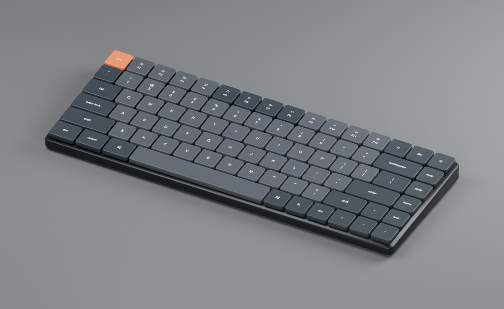
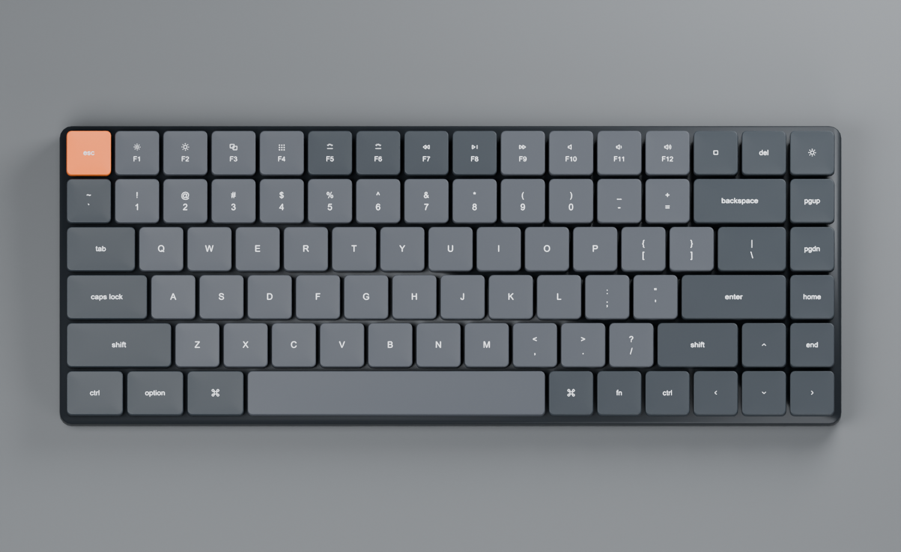
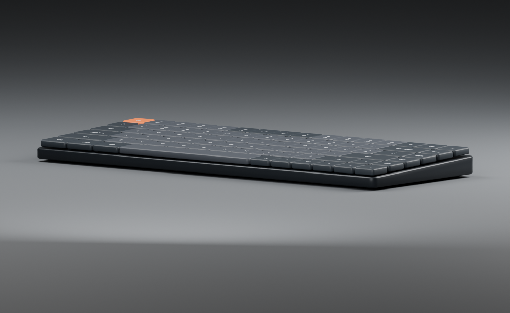
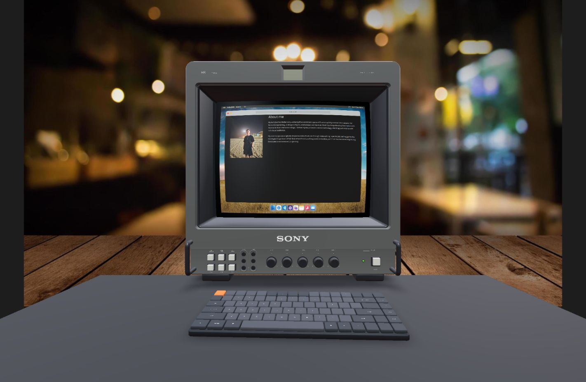

# Keyboard and workstation completion report

Created and integrated an editable, procedural 84-key low-profile keyboard and a separate dark tabletop into the existing Workstation reveal reveal. The model follows the supplied references: 16-unit compact rows, staggered modifiers, two gray key groups, a complete F-row, right navigation column, dedicated arrows, and orange Escape. The CRT asset and screen geometry remain byte-for-byte unchanged.

| Metric | Keyboard | Desk |
| --- | --- | --- |
| Dimensions, width × depth × height | 308 × 118 × 21.236 mm | 950 × 900 × 28 mm |
| Rendered triangles, including instances | 22,148 | 188 |
| Stored unique triangles | 7,298 | 188 |
| Editable mesh objects | 91 | 1 |
| Exported GLB nodes | 17 | 2 |
| Unique GLB meshes / draw primitives | 16 / 16 | 1 / 1 |
| Materials | 4 | 1 |
| Image textures | 1 | 0 |
| Production GLB size | 266,568 bytes (260.32 KiB) | 6,284 bytes (6.14 KiB) |
| Cameras, lights, external resources | 0 | 0 |

The keyboard's root is on the bottom contact plane, with meters, X horizontal, Y vertical, and +Z toward the typist. Rotation and scale are applied. Repeated keys retain translation-only instances through `EXT_mesh_gpu_instancing`, supported by the project's existing GLTF loader. They remain individually editable as linked objects in Blender.

Legends use one embedded 1024px RGBA atlas and one joined decal mesh conforming to the key tops. The 83 markings include letters, number symbols, F/media keys, modifiers, navigation labels, and arrows; the spacebar stays blank. The references' `ctrl`, `option`, command symbol, and `fn` are retained. Alpha masking keeps sorting stable. Gray variation uses vertex colors within a shared keycap material.

The tabletop is anchored to the measured minimum Y of `CRT_Stand`, -0.280866 m. The keyboard is centered approximately on the screen, offset 8 mm right and 170 mm forward with a subtle -2° yaw. Both contact gaps are zero. The conservative keyboard-to-monitor clearance is 40.86 mm; the desktop extends 61.17 mm behind the CRT and 115.66 mm beyond the keyboard. A cached contact-shadow capture adds grounding without continuous shadow passes. Its resources are disposed on unmount.

`CONFIG.workstation` holds the asset URLs, transforms, contact-shadow settings, and a 75 mm downward camera endpoint adjustment needed to show the complete keyboard. The existing camera orientation, transition timing, desktop raycasts, and screen coordinate system are preserved. `/debug` exposes keyboard position, rotation, and scale, plus desk position and scale, in a Workstation folder.

Validation passed: exported GLB structure and resource checks; Blender GLB reimport with all materials, packed image, UVs, dimensions, and instances intact; placement and projection checks at six viewport sizes; ESLint; production build; existing 18-control/11-knob monitor checks. The final production page was inspected in the browser. The reveal, return to the close portfolio view, repeated reveal, code-editor dock interaction, and physical power control were checked. The debug keyboard scale was changed to 1.1, visually verified, and restored to 1.0. No production console errors were observed.

Performance showed no material regression in the local checks. At 1280 × 720 and DPR 1.5, short paired samples measured 5.9 ms median / 6.0 ms p95 with the new meshes hidden, versus 5.8 ms / 6.2 ms with them visible. Those paired samples preceded the final cached-shadow correction; the final scene was separately observed at 162–165 FPS using the existing debug overlay. These are single-machine observations, not a cross-device benchmark.

The remaining simplifications are intentional: approximate legend typography and media icons, no switches or cable/port detailing, static keys, and a tabletop without furniture legs. The existing temporary photographic background remains. Future art direction could replace that backdrop with a full room; this delivery adds only the requested keyboard and supporting surface.

The build workflow and tunables are documented in `README.md`; the desk workflow is in `../workstation-desk/README.md`. `asset-report.json`, `import-validation.json`, `scene-validation.json`, and `browser-validation.json` retain the measured evidence. `changed-files.json` lists every added and modified file with repository-relative paths.

Three-quarter asset render:

Complete key layout:

Low-profile side view:

Final production Workstation reveal scene:

