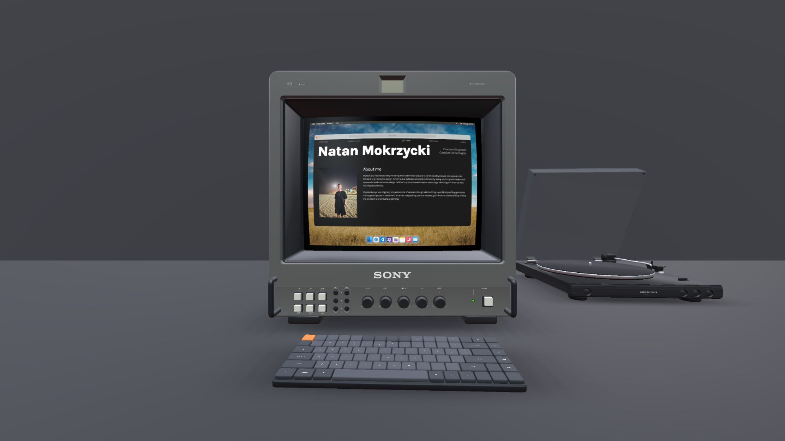
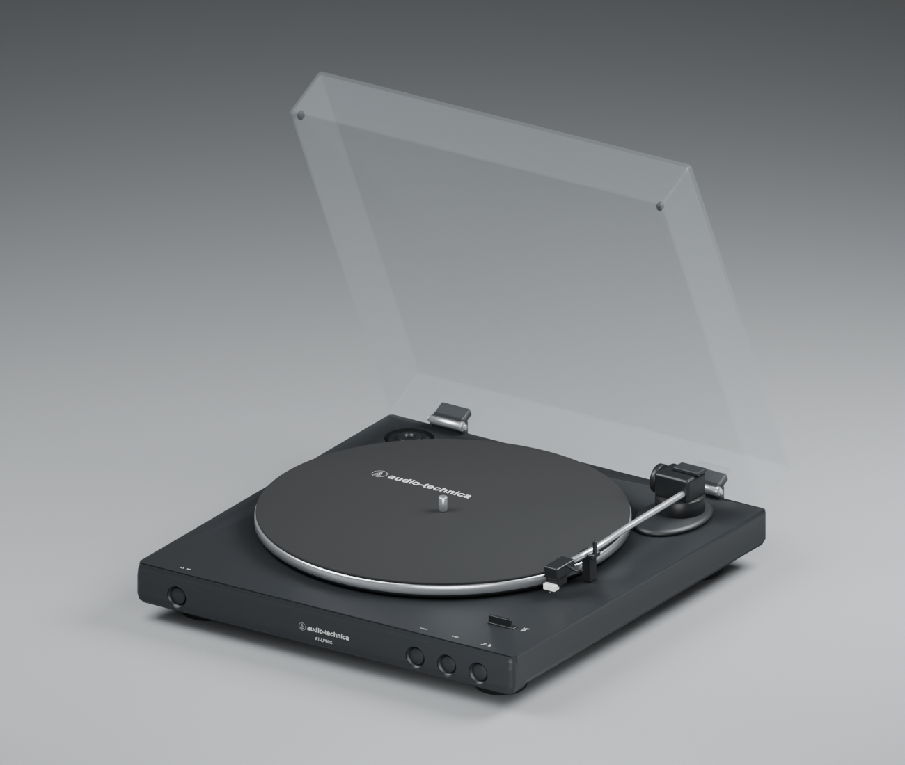

# AT-LP60X delivery

The black Audio-Technica AT-LP60X is now an editable Blender asset and a production GLB used by the workstation reveal. Modeling follows the three supplied references, with manufacturer dimensions and control names checked against the non-Bluetooth AT-LP60X manual. The blockout, subsequent material/geometry corrections and application placement iterations are described in `visual-review.md`.

| Final measurement | Result |
| --- | --- |
| Rendered triangles | 38,570 |
| GLB size | 890,380 bytes / 869.51 KiB |
| Materials / embedded images | 8 / 1 |
| Mesh objects | 62 |
| Closed dimensions, width × depth × height | 359.50 × 373.34 × 97.50 mm |
| Open dimensions, width × depth × height | 359.50 × 407.83 × 382.42 mm |
| Root contact plane | Y=0, meters, Y up, +Z front |
| Workstation position relative to desk support | (0.635, 0, -0.320) m |
| Effective position in CRT asset coordinates | (0.635, -0.2808662057, -0.320) m |
| Rotation | (0°, -3°, 0°) |
| Scale | 1 |
| Dust-cover opening | 65° |
| Desk contact gap | 0 mm |
| Conservative CRT clearance on X | 215.73 mm |
| Conservative keyboard clearance on X | 281.76 mm |
| Wall clearance including open cover | 359.87 mm |
| Front desk margin | 474.20 mm |

The 0.04 mm excess depth over the nominal 373.3 mm comes from the front branding decal offset. The physical body and hinge envelope matches the nominal depth.

The right side was chosen after inspecting the actual scene. It uses the visible empty space beside the CRT, keeps the tonearm on the outer edge, leaves the keyboard untouched and keeps the CRT visually dominant. The final position corrects the partial platter occlusion seen in the first placement test. No CRT, keyboard or desk asset was changed, and their placement and camera configuration were preserved.

The dust cover is a separate thin shell with a rear hinge pivot. Its clear gray glTF alpha-blend material was verified in Three.js after correcting a diagonal normal artifact. Opaque components share the existing cached shadow capture; the clear cover is excluded from the opaque depth capture. All turntable meshes have raycasting disabled.

## Validation

Passed GLB resource/material/hierarchy/budget checks, Blender re-import with packed atlas and preserved hinge pivot, closed/open dimensions, zero bottom contact offset, scene collision and projection checks. The production application was visually inspected at 1280×720, 1440×900 and 1920×1080, with complete desktop framing and a readable platter and tonearm.

CRT power off/on, code-editor dock activation, Safari restoration, the return to the scrollable portfolio and repeated reveal were checked. The debug turntable scale was changed to 0.9 and restored to 1; the prop and its contact shadow followed the change. The existing Stats overlay displayed 165 FPS in the local 1920×1080 debug view; this is a single-machine observation, not a benchmark. No production browser errors were observed.

`npm run lint`, `npm test`, `npm run build` and `npm run typecheck` all passed. The production build serves the final public GLB directly. No temporary runtime instrumentation or loader bypass was added.

## Intentional simplifications

Hidden drive mechanism, motor, automation internals, rear sockets, cables and underside screws are omitted. Fine felt/plastic grain and wear are omitted. Logo typography, tiny hinge pins and stylus geometry are simplified. Acrylic uses inexpensive alpha blending rather than refractive transmission. The model is reference-matched real-time geometry rather than manufacturer CAD.

The existing narrow portrait camera can crop the secondary turntable at the right edge. Its behavior is preserved; the three requested desktop sizes contain the complete prop. The full file inventory is in `changed-files.json`.

## Files created

- `public/glbs/turntable.glb`: runtime production asset.
- `assets/turntable/turntable.blend`, `turntable.glb`: editable source and matching export.
- `assets/turntable/build_turntable.py`, `build_markings.py`: reproducible source scripts.
- `assets/turntable/markings.png`, `marking-rects.json`: embedded marking atlas and coordinates.
- `assets/turntable/references/open-three-quarter.png`, `near-top.png`, `chassis-three-quarter.png`: the three supplied references.
- `assets/turntable/blockout.blend`, `blockout.glb`, `blockout-measurements.json`: proportional stage source and measurements.
- `assets/turntable/blockout-front-three-quarter.png`, `blockout-near-top.png`, `blockout-side.png`: initial inspection renders.
- `assets/turntable/front-three-quarter.png`, `near-top.png`, `side.png`: final inspection renders.
- `assets/turntable/workstation-1280x720.jpg`, `workstation-1440x900.jpg`, `workstation-1920x1080.jpg`, `debug-validation.jpg`: actual application captures.
- `assets/turntable/verify_glb.py`, `verify_import.py`, `verify_scene.mjs`: reproducible validation scripts.
- `assets/turntable/asset-report.json`, `model-measurements.json`, `import-validation.json`, `scene-validation.json`, `browser-validation.json`: measured results and browser evidence.
- `assets/turntable/README.md`, `visual-review.md`, `completion-report.md`, `changed-files.json`, `.gitignore`: workflow, review notes, report, inventory and scratch-file exclusions.

## Files modified

- `src/components/WorkstationEnvironment.tsx`: load/clone/place the prop, disable raycasting, include opaque components in the existing cached shadow.
- `src/config/constants.ts`: model URL, position, degree rotation and scale.
- `src/config/debugSettings.ts`: typed turntable settings and defaults.
- `src/components/DebugPanel.tsx`: module-level position, rotation and scale controls in the Workstation folder.

