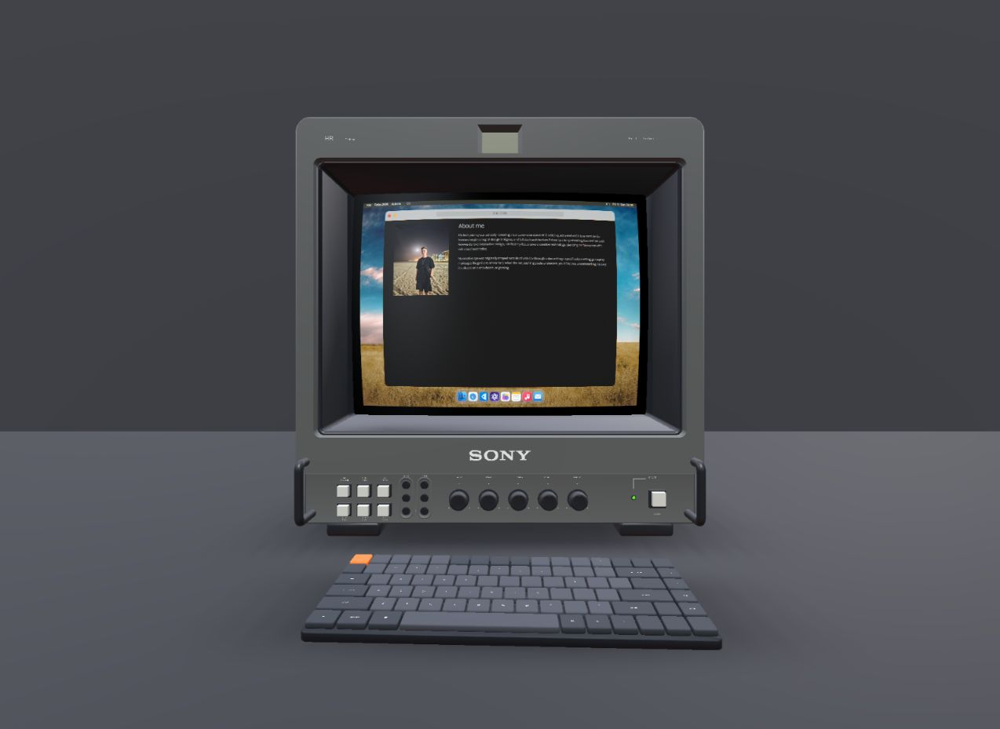

# Workstation tabletop

Separate, editable **950 × 900 × 28 mm** dark satin tabletop with 4 mm bevels, three bevel segments, and weighted normals. It is 188 triangles, one mesh, one PBR material, and no textures. There are no cameras, lights, legs, or hidden furniture details in the GLB.

The root is centered at the top surface (Y=0), with thickness extending downward. Coordinates are meters, X horizontal, Y up, +Z front. All object transforms are identity. `build_desk.py` generates `workstation-desk.blend` and `workstation-desk.glb`; the production copy is `public/glbs/workstation-desk.glb`.

```powershell
blender -b --python assets/workstation-desk/build_desk.py
python assets/keyboard/verify_glb.py assets/workstation-desk/workstation-desk.glb
Copy-Item assets/workstation-desk/workstation-desk.glb public/glbs/workstation-desk.glb
```

`WorkstationEnvironment` anchors the top to the existing CRT stand, using the same scale as the CRT screen. Placement, keyboard clearances, debug controls, previews, and the final workstation screenshot are documented in `../keyboard/README.md`. `asset-report.json` contains the verified dimensions, geometry counts, and byte size.

The scene stretches the tabletop to 5.225 m wide and 1.26 m deep, keeping its sides outside the desktop framing even at 844 × 390. Its center is Z=-0.28 m, preserving the original front edge while extending the rear to Z=-0.91 m. A matte charcoal wall replaces the photographic backdrop. Its front face follows the desk's rear edge, so changing the desk position or depth keeps them connected. Wall size, height, color, and roughness live in `CONFIG.workstation`; the wall uses one box mesh and one material, with no texture or pointer interception.


